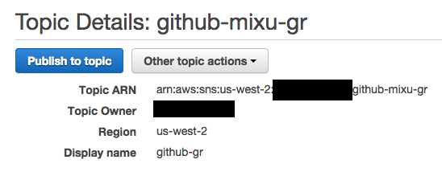
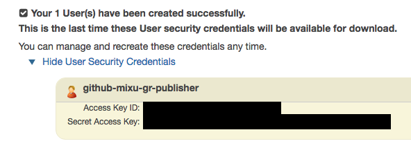
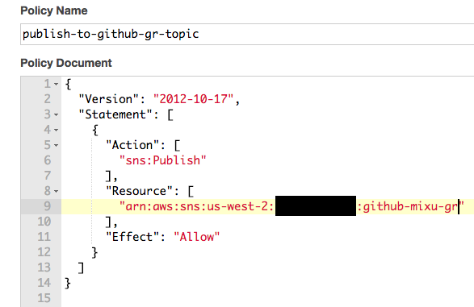
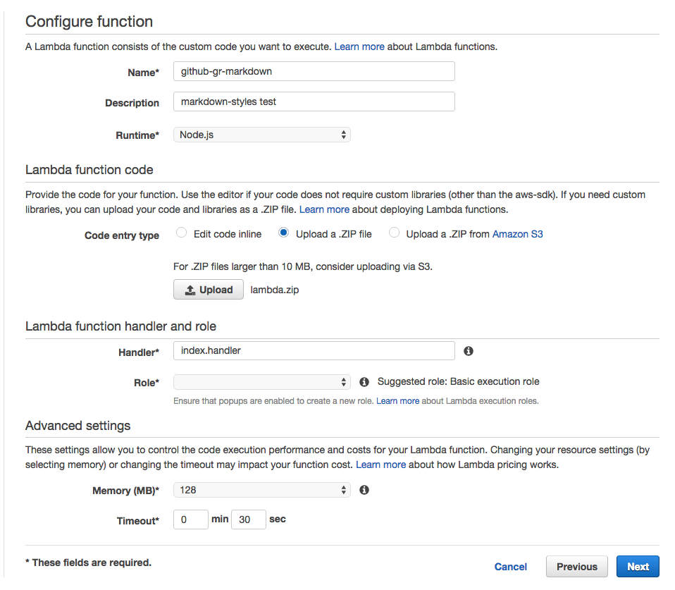
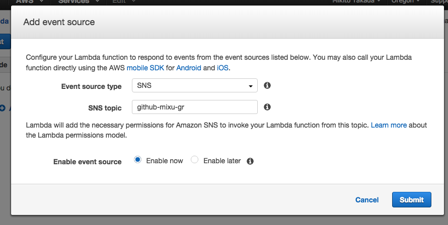

# markdown-styles-lambda

Automatic static site generation on `git push` using AWS Lambda and [markdown-styles](https://github.com/mixu/markdown-styles) using a Gulp-style API.

## Features

- automatically rebuilds your markdown files stored on Github repos in response to a git push using AWS Lambda.
- includes a full tutorial on how to set up the rebuild, assuming you are already using S3 for static site hosting
- you can use a single AWS Lambda function to process all of your Github repos; tasks are matched against a repo + branch + filename glob expression and are easily extensible via the API
- features an API inspired by the the Gulp build system: tasks, input streams and stream transformations are used to express the tasks to be done on each repo + branch
- efficient: only downloads files matching a specific glob pattern on a specific branch rather than cloning the whole repo on each rebuild

## Installation

The installation guide is pretty detailed, and sadly involves a lot of clicking around in the AWS UI. Before we get started, here's what we'll have at end:

```
              Github webhook        SNS event triggers
              sends event to SNS    lambda invocation
git push -> [Github] -> [Amazon SNS] -> [Amazon Lambda] -> [S3 bucket]
                  ^                           |      lambda function
                  \-- .md file(s) downloaded -/      regenerates & uploads
                      via the Github API             HTML files to S3
```

Basically, whenever you push to your Github repo, we'll trigger a rebuild of the markdown files on your Github repo on AWS Lambda. The `markdown-styles-lambda`:

- responds to SNS events from Github
- uses the Github API to query for files that match a specific glob
- downloads those specific files via the Github API (more efficient than cloning a full repo every time)
- rebuilds those markdown files using a specific layout and
- uploads the resulting HTML to S3

Once you've set up this pipeline, you can connect it to multiple Github repos! The same `markdown-styles-lambda` can process events from multiple Github repos - you can configure the layouts and target buckets to use for each repo separately.

I am assuming that you are already using S3 for static site hosting. If you haven't set that up, you'll probably want to [take a look at this Amazon tutorial first](http://docs.aws.amazon.com/AmazonS3/latest/dev/WebsiteHosting.html). Now, let's set this up!

### Create an SNS Topic

1. Go to the [Amazon SNS console](https://console.aws.amazon.com/sns).
2. Click **“Create topic”**.
3. Fill in the name and display name fields with whatever you’d like, then click **“Create topic”**.




Copy the topic ARN for later use.

### Create an IAM User to Publish As

1. Go to [the Amazon IAM console](https://console.aws.amazon.com/iam/home).
2. Click **“Users”** then **“Create New Users”**.
3. Enter a name for the GitHub publisher user. Make sure **“Generate an access key for each user”** is checked.

 

4. Click **“Create”**.
5. Click **“Show User Security Credentials”**, then copy or download the access and secret keys for later use.

  

### Add permissions

1. Return to [the main IAM console page](https://console.aws.amazon.com/iam/home).
2. Click **“Users”**, then click the name of your newly created user to edit its properties.
3. Scroll down to **“Permissions”** and ensure that section is open and that the **“Inline Policies”** section is expanded. Click the link (**“click here”**) to create a new inline policy.

 

4. Select the **“Custom Policy”** radio button, then press **“Select”**.

 

5. Type a name for your policy, then paste the following statements that authorize publication to the SNS topic you created in Step 1 (here’s where you use the topic ARN you were saving). Then click “Apply Policy”.

```
{
  "Version": "2012-10-17",
  "Statement": [
    {
      "Action": [
        "sns:Publish"
      ],
      "Resource": [
        <SNS topic ARN goes here>
      ],
      "Effect": "Allow"
    }
  ]
}
```



### Set up the GitHub Webhook

1. Navigate to your [GitHub](https://github.com/) repo.
2. Click on **“Settings”** in the sidebar.
3. Click on **“Webhooks & Services”**.
4. Click the **“Add service”** dropdown, then click **“AmazonSNS”**.
5. Fill out the form (supplying the IAM user credentials you created in Step 2), then click “Add service”. (Note that the label says “topic”, but it requires the entire ARN, not just the topic name.)


### Create GitHub Credentials

1. Go to [Personal access tokens](https://github.com/settings/tokens) in Github settings.
2. Click **“Generate a personal access token”**.
3. Add a token description, leaving everything else as is, then click **“Generate token”**.
4. Copy the token for later use.


### Set up the code

To write your tasks, you should create new folder and `npm install markdown-styles-lambda`.

Next, create a file called `index.js`. You can get started by using the example below:

```js
var lambda = require('markdown-styles-lambda').create();

lambda.config('s3', {
  region: 'YOUR S3 REGION HERE'
});

lambda.config('github', {
  type: 'oauth',
  token: 'YOUR GITHUB TOKEN HERE',
});

lambda.task('mixu/cssbook - generate markdown', function(task) {
  // generate markdown from /input/*.md to /
  return task.github('/input/*.md')
      .pipe(task.generateMarkdown({
        layout: 'github'
      }))
      .pipe(task.s3('s3://bucket/path'));
});

lambda.task('mixu/cssbook - copy assets', function(task) {
  // copy /layout/assets/**/* to /assets
  return task.github('/layout/assets/**/*', { buffer: false })
             .pipe(task.s3('s3://bucket/path/assets'));
});

lambda.task('mixu/cssbook - copy non-markdown files', function(task) {
  // copy /input/**/*.!(md) to /
  return task.github('/input/**/*.!(md)', { buffer: false })
             .pipe(task.s3('s3://bucket/path'));
})

exports.handler = lambda.snsHandler('PushEvent');
```

As you can see in the example above, `markdown-styles-lambda` uses a [Gulp-style API](http://gulpjs.com/), which means it is configured by writing short tasks using code. I considered a JSON-based format, but it would never be as flexible as code.

Each task is defined using  `lambda.task(target, fn)`.

- `target` is a string that specifies a target repo and a task name string separated by ` - `, e.g. `user/repo#branch - taskname`. The target repo and branch is parsed out and used to match against incoming SNS events.
- `fn` is a `function(task) { ... }` that is called when an event arrives from the repo specified in `target`

Each task receives a `task` object instance. The actual work is defined using the Task API. Tasks have three kinds of functions:

- input stream functions (`task.github(glob)` and `task.fromFs(glob)`): these return readable streams that can be `.pipe()`d into other streams
- transform stream functions (`task.generateMarkdown(opts)`): these modify the objects returned from input streams, then pass the modified objects along and can be `pipe()`d into other streams
- output stream functions (`task.s3(target)`, `task.toFs(path)`): these functions take the `.path` value, and write it to S3 or to the filesystem

At the end of the file we are assigning `lambda.snsHandler('PushEvent')` to `exports.handler`. AWS will invoke this function when a Github SNS event arrives; it is a simple wrapper that calls `lambda.exec` to run the relevant tasks when a Github `PushEvent` is received.

The built-in functions stream files directly from Github without writing them to disk. Each file is represented by an object with a couple of keys (`path`, `contents`, `stat`). See the [full API docs](#api) below for more information.

You can easily write your own tasks operations; they just need to be object mode streams that take a single object with the aforementioned keys and that change the keys in some way (convert the content to markdown, change the output path etc.). [`pipe-iterators`](https://github.com/mixu/pipe-iterators) provides a bunch of shortcuts for writing object mode streams.

### Testing your lambda locally

The easiest way to test your lambda locally is to add the following line at the end of the file:

```js
lambda.exec(process.argv.slice(2));
```

This allows you to use `node index.js <target>` to run your lambda tasks. If you run `node index.js` with no additional arguments, you will get a list of targets:

```
$ node index.js
[markdown-styles-lambda] No tasks matched []
[markdown-styles-lambda] Known targets:
  mixu/cssbook#master
  mixu/nodebook#master
[markdown-styles-lambda] Known tasks:
  mixu/cssbook - single page
  mixu/nodebook - single page
```

You can specify either the name of a repo, e.g. `node index.js mixu/cssbook` to run all tasks specified on that repo, or you can run a specific task e.g. `node index.js 'mixu/cssbook - single page'`.

**Setting your AWS profile from the CLI**. By default, `markdown-styles-lambda` will read your AWS default config since it uses [`aws-sdk`](http://docs.aws.amazon.com/AWSJavaScriptSDK/guide/node-configuring.html) to access S3. To quickly set your AWS profile, you can use `AWS_PROFILE=user2 node index.js <args>`.

**Setting your AWS profile programmatically**. You can also programmatically set your AWS profile (after installing `aws-sdk` on your local machine).

```js
var AWS = require('aws-sdk');
var credentials = new AWS.SharedIniFileCredentials({profile: 'user2'});
lambda.config('s3', {
  credentials: credentials
});
```

### Create a zip file to upload

Now, prepare a zip file for Lambda:

```
zip -r lambda.zip . -x "*.git*" "node_modules/aws-sdk/**"
```

If you are on Windows, just make a zip file from the root of the git repo. Remember that AWS Lambda function zip files should include your `node_modules` folder!

### Create a Lambda Function

1. Open [the AWS Lambda console](https://console.aws.amazon.com/lambda/home).
2. Click on **“Create a Lambda function”**.
3. Click on **"Upload a .ZIP file"**.

 

4. Set the **Role** to `lambda_s3_exec_role` (this adds the permission for S3)

 

5. Set the **Advanced settings**. 192 MB, 30 seconds recommended just in case, but typically I'm seeing about ~44MB used, and ~8 seconds; but this is network I/O and your files may be different).
6. Click **“Create Lambda function”**.
7. On the Lambda function list page, click the **“Actions”** dropdown then pick **“Add event source”**.

 

8. Select **“SNS”** as the event source type.
9. Choose the SNS topic you created in Step 1, then click **“Submit”**. (Lambda will fill in the ARN for you.)

## Testing your setup

Since there are three systems involved in invoking the lambda, there are three different places where you can trigger an event: the lambda console, the SNS console and the Github webhook UI.

### Testing from the Lambda console


1. In the Lambda console functions list, make sure your lambda function is selected, then
2. choose **“Edit/Test”** from the Actions dropdown.
3. Choose **“SNS”** as the sample event type, then
4. click **“Invoke”** to test your function.

### Testing from the SNS console

1. In the AWS SNS console, open the **“Topics”* tab,
2. select your **GitHub publication topic**, then
3. use the **“Other topic actions”** to select **“Delivery status”**.
4. Complete the wizard to set up CloudWatch Logs delivery confirmations, then press the **“Publish to topic”** button to send a test message to your topic (and from there to your Lambda function).

You can then go to the CloudWatch Log console to view a confirmation of the delivery and (if everything is working correctly) also see it reflected in the CloudWatch events for your Lambda function and you Lambda function’s logs as well.

### Testing from Github

1. In the **“Webhooks & Services”** panel in your GitHub repository, click the **“Test service”** button.
2. Open the **AWS Lambda console**.
3. In the function list, under **“CloudWatch metrics at a glance”** for your function, click on any one of the **“logs”** links.
4. Click on the **timestamp column header** to sort the log streams by time of last entry.
5. Open the **most recent log stream**.
6. Verify that the event was received from GitHub.

# API

### API - Lambda

#### lambda.create()

An easier-to-type equivalent to `new (require('markdown-styles-lambda'))()`. Start your app by running `lambda = require('markdown-styles-lambda').create();`

#### lambda.config(key, hash)

Sets configuration for a specific key. The supported keys are:

- `s3`: the set of parameters passed to [`new AWS.S3()`](http://docs.aws.amazon.com/AWSJavaScriptSDK/latest/AWS/S3.html#constructor-property).  You'll want to set the region property to match the region of your S3 bucket; the credentials are already set correctly when running a Lambda.
- `github`: the set of parameters passed to [`github.authenticate()`](http://mikedeboer.github.io/node-github/#Client.prototype.authenticate). Set the token to the oAuth token you obtained earlier.

`lambda.config` can also be called with one or zero parameters:

- `lambda.config(hash)`: sets the configuration hash; the hash should have keys like `s3: {}` and `github: {}`
- `lambda.config()`: returns the configuration hash

#### lambda.task(target, [deps], fn)

Define a new task to be run against `target`.

- `target` can be:
  - a string like `user/repo#branch-or-sha - task name`
  - an array of target name strings
- `deps` is an optional array of task names to be executed and completed before your task will run.
- `fn` can be:
  - a synchronous function like `function(task) { ... }`
    - that returns a stream `function(task) { return stream })`
    - that returns a promise `function(task) { return promise })`
  - an asynchronous function that takes a `onDone` callback (e.g. `function(err)`) like `function(task, onDone) { onDone(err); }`

#### lambda.exec(event, [onDone])

Given a specific event, executes all tasks that match the event

- `event` can be:
  - a Github event. The event repo name, username and branch are parsed with [identify-github-event](https://github.com/mixu/identify-github-event) which should be able to handle any github event that has the necessary fields.
  - a string
    - which matches a Github repo in the form `user/repo#branch`; all tasks that are defined against that repo are run
    - which matches a specific target string to run
  - an array of strings that are repos or targets
- `onDone` is an optional function to call after execution has been completed. It can be a AWS context object or a function `function(err) { ... }` that is called on completion

#### lambda.identifyGithubEvent(event)

Returns the canonical, CamelCased name of a Github event given a JSON hash that is a Github event. The actual work is done by [identify-github-event](https://github.com/mixu/identify-github-event).

### API - Task

Each lambda task receives an instance of `Task`. There is nothing particularly special about the task object: it is just a placeholder for some additional configuration properties and a convenient place to put a couple of methods; feel free to use it or just do your own thing when writing your own lambdas.

#### task properties

Each task instance has several properties that may be useful:

- `task.user`: the username part of the current repo
- `task.repo`: the repo name part of the current repo
- `task.branch`: the current branch

These are kind of smuggled into the builtin functions so that you don't need to repeat the username/repo/branch info when calling `task.*` functions.

#### task.github(glob, [opts])

Emits downloaded Github files matching the provided glob on the current repository. Returns a readable stream of file objects that can be [piped](https://nodejs.org/api/stream.html#stream_readable_pipe_destination_options) to plugins.

The file objects have the following keys:

- `path`: a path from the base of the glob expression to the matched file
- `stat`: (the fs.stat object associated with the input file),
- `contents`: (a string with the content of the input file).

The `opts` hash can have the following properties:

- `base`: `file.path` is set to a path relative to the base of the glob expression. You can set `base` explicitly to `/` or some other path to get file paths that are relative to the root of the repo (`/`) or some other path.
  For example, given the glob `/input/**/*.md`, the automatically detected base would be `/input`; e.g. `/input/foo.md` gets `file.path = '/foo.md'` and `/input/foo/bar.md` becomes `/foo/bar.md`.
- `buffer`: If true (the default), `file.contents` is set to a string. If false, `file.contents` is set to a readable stream. This is useful for working with large files and/or binary files which should not be decoded as strings.
- `read`: Setting this to false will return the Github file metadata object as `file.contents` and skip reading the file over HTTPS.

You can safely start multiple `task.github()` calls at the same time against the same repo. They all share the same in-memory-cache and request deduplicator logic, so concurrent tasks that fetch the same API endpoint will share the same response (rather than making extra calls against the API).

To limit the number of directory traversal API calls needed, make sure you use a fairly specific glob expression. For example `input/*.md` is better than `**/*.md` because it only requires reading the `input/` directory's contents whereas `**/*.md` will require loading traversing all folders within the Github repository.

Remember to set `{ buffer: false }` when copying (binary) files, e.g:

```js
lambda.task('mixu/cssbook - copy assets', function(task) {
  // copy /layout/assets/**/* to /assets
  return task.github('/layout/assets/**/*', { buffer: false })
             .pipe(task.s3('s3://bucket/path/assets'));
});
```

#### task.fromFs(glob, [opts])

Emits files matching provided glob or an array of globs from the file system.

The file objects have the following keys:

- `path`: a path from the base of the glob expression to the matched file
- `stat` (the fs.stat object associated with the input file),
- `contents` (a string with the content of the input file).

`opts` are the same as in `task.github`.

#### task.generateMarkdown(opts)

Calls [`markdown-styles`](https://github.com/mixu/markdown-styles) to generate HTML from markdown. Also changes the file `path` extension to `.html`. Accepts the following options (see [`markdown-styles`](https://github.com/mixu/markdown-styles) for more info):

- `layout`: a name of a builtin layout or a path relative to the root of the repo to use for the `markdown-styles` tasks
- `asset-path`: the path to the assets folder, relative to the output URL
- `meta`: a JSON hash that has the contents of the `meta.json` file to merge in
- `layout`: name of a builtin layout or an absolute path to a layout
- `highlight-extension`: a string that specifies the name of a highlighter module or an absolute path to a highlighter module for `extension`, e.g. `--highlight-csv /foo/highlight-csv`.

Generally speaking you want to fully specified paths, such as:

```js
task.github('/input/*.md')
    .pipe(task.generateMarkdown({
      layout: __dirname + '/layout'
    }))
    .pipe(task.s3('s3://bucket/path'));
```

##### Renaming files and using an alternative asset path

If you want to change the path of the files, you can change the `path` property on the file objects. Rule #1: always rename files before converting them to markdown so that any asset paths are resolved correctly.

`markdown-styles` assumes that your `/assets` folder is in the same folder as your markdown files. If you want to have your assets folder somewhere else, make sure you set `asset-path` to the asset folder location relative to the root of the output domain.

In the example below, I am renaming `readme.md` to `index.html`, and writing the readme from `/readme.md` in the Github repo to `/nwm/index.html` (e.g. `http://mixu.net/nwm/index.html`), with relative asset paths that go to `/assets` (`http://mixu.net/assets`).

```js
lambda.task('mixu/nwm', function(task) {
  return task.github('/*.md')
      .pipe(pi.map(function(file) {
        // from /*.md -> /nwm/*.md
        file.path = '/' + task.repo + file.path;
        return file;
      }))
      .pipe(task.generateMarkdown({
        layout: __dirname + '/layouts/readme',
        // E.g. assets are located in /assets
        'asset-path': '/assets',
      }))
      // prepends s3://bucket/ to every incoming path
      // e.g. output goes to s3://bucket/nwm/*.html
      .pipe(task.s3('s3://bucket/'));
});
```

#### task.s3(target)

Returns a writable stream that can be piped to and it will write files to S3.

`target` should be a string in the format `s3://bucket/path`, where `bucket` is the name of the S3 bucket and `path` is some path within the bucket.

Since `.github() / .fromFs()` produce relative file paths, the final file path is produced by taking the value in `file.path` and prepending `target` to it.

#### task.toFs(outdir)

Returns a writable stream that can be piped to and it will write files to the file system. `outdir` is the output folder to write files to.

Since `.github() / .fromFs()` produce relative file paths, the final file path is produced by taking the value in `file.path` and prepending `outdir` to it.
